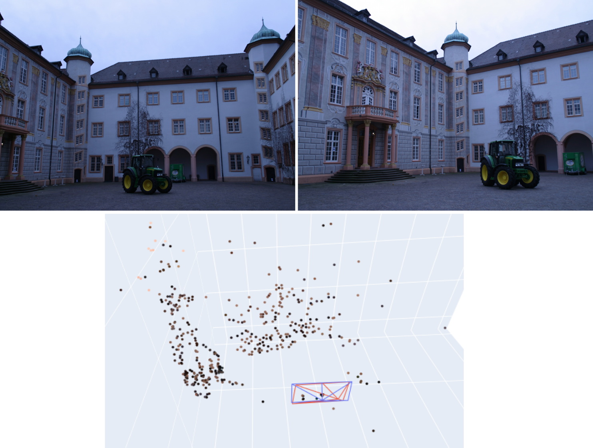

# MCV-M4-3D-Vision: 3D Reconstruction of Urban Scenes
Projects for the subject on 3D vision of the Master in Computer Vision (UAB)

## Summary
This repository contains the code related to the project on '3D Recovery of Urban Scenes' of the [Module 4: 3D Vision](https://pagines.uab.cat/mcv/content/m4-3d-vision) of the Master in Computer Vision at UAB. 

The aim of this master module is to perform 3D reconstruction of buildings from a set of images taken from different points of view (frontal images of the façades and aerial images). Specifically, we rectify the perspective distortion from a single view, estimate essential and fundamental matrix, calibrate a camera with a planar pattern, estimate the depth of points in the scene given two images, generate new views of the scene, and compute a 3D model either from a set of calibrated or uncalibrated cameras (SfM).

The final presentation explaining our approach can be found [here](https://github.com/IanRiera/MCV-M4-3D-Vision/blob/master/M4_Final_Presentation_Team7.pdf).

The module consists of 5 different deliveries that build up to a complete pipeline. Refer to the specifics `README.md` for further explanations, requirements and the complete code of each week.
 
* [Week 1: Planar Transformations and Image Rectification](https://github.com/IanRiera/MCV-M4-3D-Vision/tree/master/image_rectification)

* [Week 2: Homography Estimation and Applications](https://github.com/IanRiera/MCV-M4-3D-Vision/tree/master/homography_estimation)

* [Week 3: Fundamental Matrix Estimation and Applications](https://github.com/IanRiera/MCV-M4-3D-Vision/tree/master/fundamental_matrix_applications)

* [Week 4: Reconstruction from Two Images](https://github.com/IanRiera/MCV-M4-3D-Vision/tree/master/reconstruction_from_two_images)

## Contributors: Team 7
- Josep Brugués i Pujolràs ([email](mailto:josep.brugues@e-campus.uab.cat))
- Òscar Lorente Corominas ([email](mailto:oscar.lorentec@e-campus.uab.cat))
- Ian Riera Smolinska ([email](mailto:ianpau.riera@e-campus.uab.cat))
- Sergi García Sarroca ([email](mailto:sergi.garciasa@e-campus.uab.cat))

